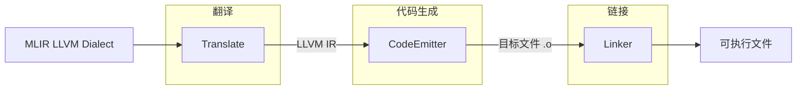
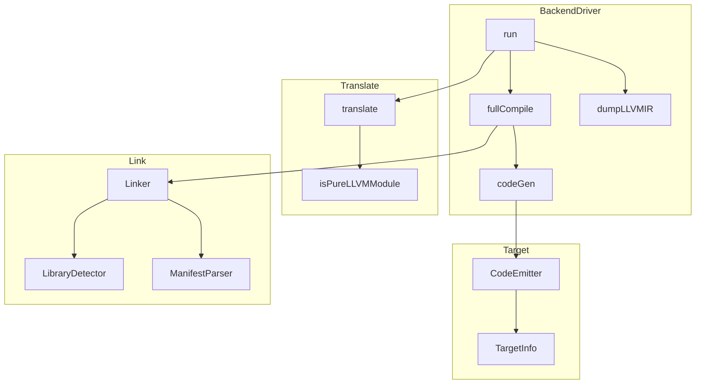
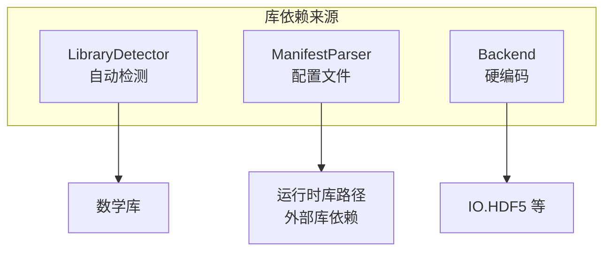
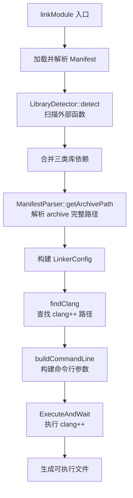

# 后端设计

## 1. 概述

后端是 EzComp 编译器的最终阶段，负责将中端生成的 MLIR LLVM 方言转换为可执行文件。后端的输入为 MLIR ModuleOp（仅包含 LLVM 方言操作），输出为目标平台可执行文件。

### 处理流程

### 编译模式

后端支持两种编译模式：

- **DumpLLVMIR**：仅输出 LLVM IR 到标准输出，用于调试。此模式下翻译完成后直接打印 LLVM IR，不进行代码生成和链接。
- **FullCompile**：完整编译流程，依次执行翻译、代码生成、链接三个阶段，最终生成可执行文件。

---

## 2. 整体架构

### 2.1 模块划分

- **BackendDriver**：后端驱动，协调整个编译流程
- **Translate**：MLIR LLVM 方言 → LLVM IR 翻译
- **Target**：目标代码生成
  - **CodeEmitter**：LLVM IR → 目标代码
  - **TargetInfo**：目标平台信息查询
- **Link**：链接器
  - **Linker**：调用 clang++ 进行链接
  - **LibraryDetector**：自动检测所需库依赖
  - **ManifestParser**：解析运行时库配置文件

### 2.2 模块交互

---

## 3. 翻译设计

翻译阶段将 MLIR LLVM 方言转换为 LLVM IR Module。此阶段调用 MLIR 框架提供的标准翻译接口，不进行额外的 IR 变换。

### 3.1 纯 LLVM 模块检查

翻译前需确保模块仅包含 LLVM 方言操作。如果存在未降级的其他方言操作（如 Comp 方言、Affine 方言等），翻译会失败。

检查逻辑遍历模块中的所有操作，判断其方言命名空间是否为 `llvm` 或 `builtin`。若发现其他方言操作，报错提示用户先运行中端降级管线。

### 3.2 方言翻译接口注册

MLIR 框架采用插件式架构，每种方言的翻译逻辑需显式注册。翻译前注册 `BuiltinDialectTranslation` 和 `LLVMDialectTranslation`，确保框架能正确处理这两种方言的翻译。

### 3.3 翻译执行

调用 `mlir::translateModuleToLLVMIR` 执行翻译。该函数遍历 MLIR 模块中的操作，逐个转换为对应的 LLVM IR 结构，最终输出完整的 `llvm::Module`。

---

## 4. 代码生成设计

代码生成阶段将 LLVM IR 编译为目标代码（目标文件或汇编文件）。此阶段涉及目标平台初始化、代码发射两个核心步骤。

### 4.1 目标平台初始化

**目标三元组**：描述目标平台的字符串，格式为 `arch-vendor-os`，如 `x86_64-pc-linux-gnu`、`aarch64-apple-darwin`。用户可通过 `-target` 选项指定，未指定时使用宿主机默认三元组。

**目标初始化**：LLVM 采用按需初始化策略，使用前需调用 `InitializeAllTargets` 等函数注册目标支持。

**TargetMachine 创建**：根据目标三元组查找对应的 Target，创建 TargetMachine 实例。创建时配置 CPU、特性、重定位模型等参数。

### 4.2 代码发射

代码发射使用 LLVM 的 PassManager 框架。`TargetMachine::addPassesToEmitFile` 将代码发射 Pass 添加到 PassManager，运行后输出目标代码。

**发射流程**：

1. 设置模块的 DataLayout 和 TargetTriple，确保代码生成使用正确的目标信息
2. 创建 `legacy::PassManager`
3. 调用 `addPassesToEmitFile` 添加发射 Pass，指定输出文件类型
4. 运行 PassManager，输出到文件

**输出类型**：

- ObjectFile：目标文件（.o / .obj），包含机器码和重定位信息
- AssemblyFile：汇编文件（.s / .asm），包含可读的汇编代码

### 4.3 TargetInfo 封装

`TargetInfo` 封装 `TargetMachine`，提供统一的目标平台信息查询接口。

**设计目的**：后端多处需要查询目标平台信息（如数据布局、架构特性），直接操作 `TargetMachine` 接口分散且易重复。`TargetInfo` 提供统一的查询入口，简化调用方代码。

**查询能力**：

- 基础信息：目标三元组、CPU 名称、目标特性
- 数据布局：指针宽度、类型大小、类型对齐
- 架构特性：是否 64 位、是否小端序、架构/厂商/操作系统名称

---

## 5. 链接设计

链接阶段将目标文件与所需库合并，生成可执行文件。此阶段涉及链接器选择、库依赖管理、链接执行三个核心问题。

### 5.1 链接器选择

不同平台使用不同链接器：

- Linux：ld.bfd、ld.gold、lld
- macOS：ld64
- Windows：link.exe

各链接器参数差异大，直接调用需处理复杂的平台适配逻辑。

**解决方案**：统一使用 clang++ 作为链接器前端。clang++ 根据目标平台自动选择正确的底层链接器，并提供一致的命令行接口。调用方只需构建标准参数列表，无需关心底层链接器差异。

### 5.2 库依赖管理

链接阶段需要处理三类库依赖：

**自动检测**：`LibraryDetector` 扫描 LLVM Module 中的外部函数声明（即 `isDeclaration()` 为 true 的函数）。若发现数学函数调用（如 `pow`、`sin`、`llvm.sqrt.f64` 等），根据目标平台判断是否需要链接数学库。

**平台适配**：

- macOS / Windows：数学函数内置，无需额外链接
- Linux / Unix：需要链接 `-lm`

**配置文件**：运行时库路径因安装位置不同而变化，无法硬编码。引入 manifest JSON 机制，CMake 配置时生成 manifest 文件，路径使用占位符（`@VAR@`）。运行时 `ManifestParser` 解析 manifest，将 archive key 解析为完整路径。

**硬编码**：编译器内置依赖的 archive（如 `IO.HDF5`）通过 `Backend::getRequiredArchives()` 返回。这些是编译器本身提供的运行时库，链接时必须包含。

### 5.3 链接流程

---
