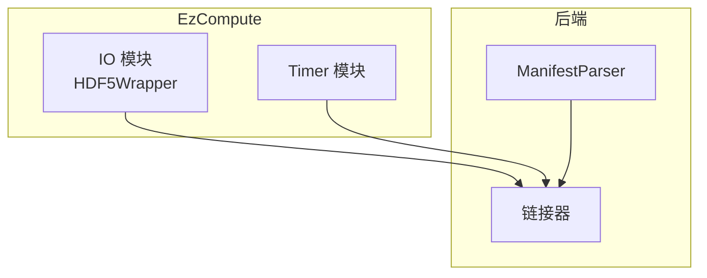
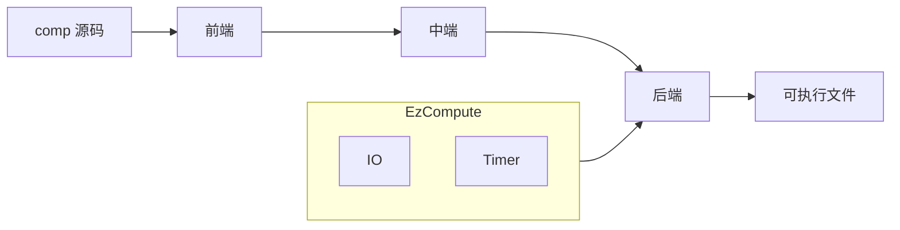
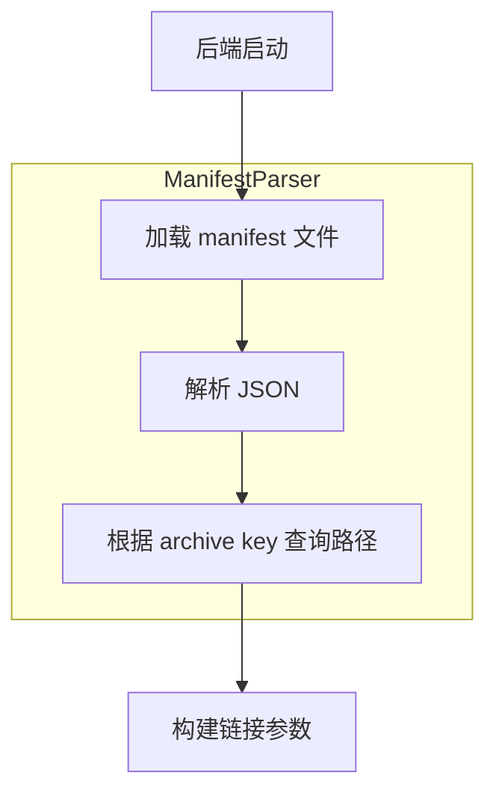
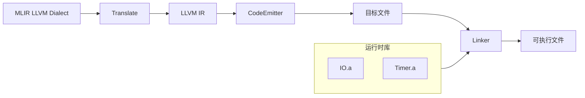
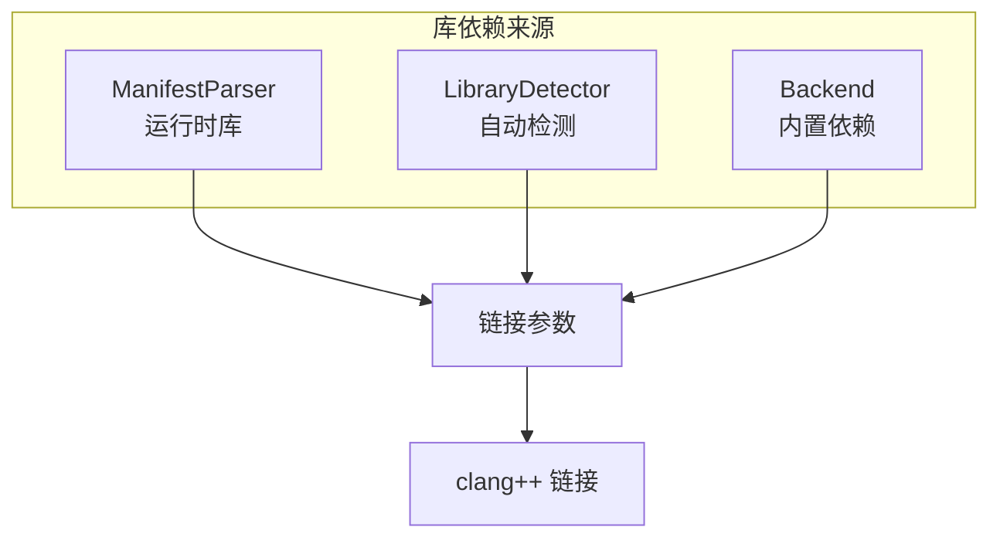

# 运行时库设计

## 1. 概述

运行时库（EzCompute）为 EzComp 编译生成的代码提供运行时支持。当前包含两个功能模块：

- **IO 模块**：HDF5 格式的结果输出
- **Timer 模块**：计时功能

运行时库以静态库形式提供，在后端链接阶段与用户代码合并，最终生成可执行文件。

---

## 2. 整体架构

### 2.1 模块划分



### 2.2 与编译器的关系



运行时库不参与编译过程，仅在后端链接阶段介入。链接器通过 manifest 配置文件定位运行时库的路径。

---

## 3. 模块设计

### 3.1 IO 模块

数值计算程序需要将计算结果持久化输出。HDF5 是科学计算领域广泛使用的数据格式，支持多维数组的紧凑存储、元数据绑定以及跨语言跨平台的数据交换。IO 模块封装 HDF5 的复杂性，为编译器生成的代码提供简洁的 C ABI 接口。

输出文件固定为当前工作目录下的 `result.h5`。

**数据集**：

- `/result`：当前时间步的空间数据，维度为 `(N1, N2, ...)`
- `/coord_<dim>`：各空间维度的坐标数组，等间距采样

**属性**：

- `time_index`：当前时间下标
- `layer_index`：ping-pong 缓冲中使用的层索引
- `space_rank`：空间维度数
- `dim_names`：维度名称数组
- `<dim>.lower` / `<dim>.upper` / `<dim>.points`：各维度的坐标范围和点数

### 3.2 Timer 模块

数值计算程序的性能测量是开发调试的重要环节。Timer 模块提供简单的计时接口，用于测量代码段执行时间。计时结果输出到 stderr，不影响 HDF5 数据输出。使用 `thread_local` 存储计时起点，每个线程独立计时，互不干扰。

---

## 4. 构建系统

### 4.1 CMake 配置概述

运行时库的构建遵循以下原则：

- 所有静态库输出到 `${CMAKE_BINARY_DIR}/lib`
- 使用 CMake 的 `configure_file` 机制生成 manifest 文件
- HDF5 支持两种获取方式：系统安装 / 子模块编译

### 4.2 manifest 机制

#### 设计目的

运行时库的安装路径因构建环境不同而变化，无法在编译器代码中硬编码。manifest 机制解决以下问题：

- 运行时库路径的动态配置
- 外部依赖库的声明
- 编译器与运行时库的解耦

#### JSON 结构

manifest 文件（`EzComputeRuntime.manifest.json`）包含两个字段：

```json
{
  "version": 1,
  "archives": {
    "IO.HDF5": "@EZCOMPUTE_HDF5_WRAPPER_REL@",
    "Timer": "@EZCOMPUTE_TIMER_REL@"
  },
  "libraries": [
    "@EZCOMPUTE_HDF5_LIBS@"
  ]
}
```

**archives 字段**：运行时库的内部模块映射

- Key：模块标识符，编译器通过此标识符引用模块
- Value：静态库的相对路径（相对于 `${CMAKE_BINARY_DIR}`）

**libraries 字段**：外部依赖库列表

- 运行时库依赖的外部库路径
- 如 HDF5 库路径，由 CMake 的 `find_package` 自动检测

#### 占位符替换流程


CMake 配置时：

1. 源文件中的 `@VAR@` 占位符对应 CMake 变量 `VAR`
2. `configure_file` 将占位符替换为变量值
3. 生成的 manifest 文件放入 `${CMAKE_BINARY_DIR}`

#### 后端解析流程



后端的 `ManifestParser` 负责：

- 从构建目录加载 `EzComputeRuntime.manifest.json`
- 解析 JSON 结构，建立 key → path 的映射
- 提供查询接口 `getArchivePath(key)` 返回完整路径

链接阶段，后端根据编译器内置的 `requiredArchives` 列表（如 `IO.HDF5`），通过 `ManifestParser` 解析出对应静态库路径，传递给链接器。

---

## 5. 与编译器的集成

### 5.1 后端调用流程



运行时库在链接阶段介入，与用户代码合并生成最终可执行文件。

### 5.2 链接方式

后端链接阶段需要处理三类库依赖：



- **ManifestParser**：解析 manifest，提供运行时库路径
- **LibraryDetector**：扫描 LLVM IR 中的外部函数调用，自动检测需要的系统库（如 `-lm`）
- **Backend 内置**：编译器硬编码的依赖，如 `IO.HDF5`

---

## 6. 遇到的问题与解决方案

### 6.1 链接器的平台适配问题

**问题**：最初设计时，计划使用 LLVM 本地编译的 clang 作为后端链接器前端。
然而 HDF5 需要链接 pthread，但 pthread 是 POSIX 标准库，在 Windows 下并非原生支持，导致链接阶段出现问题。

**解决方案**：改用编译项目所用的编译器（CMake 检测到的 C++ 编译器）作为链接器前端。
由于LLVM 的编译本身也需要链接 pthread，因此编译项目所用的编译器能够处理 pthread 依赖，
从而避免平台适配问题。