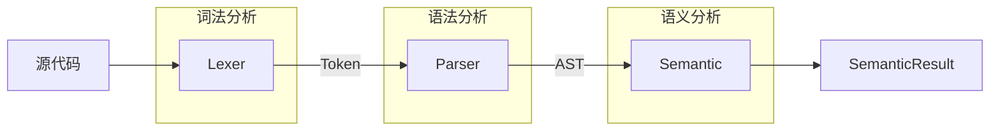

# 前端设计

## 1. 概述

前端是 EzComp 编译器的第一阶段，负责将 comp 源代码转换为语义分析结果。前端的输入为 comp 源文件，输出为 `SemanticResult` 结构，包含符号表、方程分组、Stencil 信息等，供中端 IR 生成使用。

### 处理流程

---

## 2. 整体架构

### 2.1 模块划分

- **Lexer**：词法分析，字符流 → Token 序列
- **Parser**：语法分析，Token 序列 → AST
- **AST**：抽象语法树定义与遍历
- **Semantic**：语义分析，AST → 语义结果
- **DiagnosticBase**：统一错误诊断
- **OptionTable**：选项表管理
- **DependencyGraph**：方程依赖图与拓扑排序

### 2.2 关键数据结构

- `Token`：词法单元，含类型、位置、文本切片
- `ModuleAST`：AST 根节点，包含声明、方程、选项三列表
- `SymbolTable`：符号表，变量名到定义域的映射
- `EquationGroups`：方程分组（init/boundary/iter）
- `StencilInfo`：Stencil 偏移信息
- `SemanticResult`：语义分析最终结果

---

## 3. 词法分析设计

### 3.1 Token 分类

Token 分为以下几类：
- **关键字**：`declarations`、`equations`、`options`
- **字面量**：数字（整数/浮点/科学计数法）、字符串
- **标识符**：变量名、函数名（如 `diff`、`sin` 等）
- **符号**：括号、运算符、分隔符

### 3.2 零拷贝实现

Token 采用"切片"设计，内部存储指向源码 buffer 的指针和长度，不分配内存、不拷贝字符串。
Lexer 维护一个 `curPtr` 指针，线性扫描源码 buffer，Token 的文本内容通过 `llvm::StringRef` 类型存储，
直接指向 buffer 中的对应片段。

### 3.3 关键字识别策略

仅将三个语法结构保留字（`declarations`、`equations`、`options`）识别为关键字，
`diff`、`sin`、`exp` 等数学函数名作为普通标识符处理，在语义层再识别为函数调用。这样保持语言可扩展性，用户可定义其他数学函数。

### 3.4 数字处理策略

负号不并入数字 Token，而是单独作为运算符。例如 `-6` 解析为 `minus` + `number(6)`，而非单个负数 Token。

这样设计的原因：
- 保持词法层无上下文，Lexer 不需要知道当前位置是否期望数字
- 支持 options 中 `precision:-6` 的写法
- 与表达式解析一致，`-x` 和 `-6` 都是一元运算

### 3.5 注释处理

支持 `#` 开头的行注释，遇到 `#` 后跳过直到行尾。

---

## 4. 语法分析设计

### 4.1 文法定义

comp 语言由三个 Section 组成：
- `declarations`：变量声明，格式为 `name[min, max, points]`
- `equations`：方程定义，格式为 `lhs = rhs`
- `options`：选项配置，格式为 `key: value`

表达式支持：
- 数字和字符串字面量
- 变量引用
- 函数调用
- 一元运算（`+`、`-`）
- 二元运算（`+`、`-`、`*`、`/`）
- 括号表达式

### 4.2 解析算法

采用**递归下降 + 优先级爬升**混合策略：
- Section、Item 等结构采用递归下降，每个语法结构对应一个解析函数
- 表达式采用优先级爬升算法处理运算符优先级

优先级定义：
- `*` `/` 优先级较高（40）
- `+` `-` 优先级较低（20）

### 4.3 优先级爬升算法思路

算法核心思想：根据运算符优先级决定结合顺序。解析表达式时，先解析左侧操作数，然后循环处理后续运算符。
如果下一个运算符优先级更高，则先递归解析右侧；否则直接结合当前左右操作数。

### 4.4 错误恢复策略

- **Section 内部错误**：跳到下一个 section 关键字（`declarations`/`equations`/`options`）
- **Item 内部错误**：跳到分号或右花括号

这样可以在遇到错误后继续解析，报告更多错误信息。

### 4.5 连续运算符检测

通过记录前一个 Token，检测 `++5`、`--5`、`+-5` 等非法写法并报错。

---

## 5. 抽象语法树设计

### 5.1 节点类型层次

AST 节点分为三类：
- **表达式节点**：整数、浮点数、字符串、变量引用、一元运算、二元运算、函数调用、括号表达式
- **顶层项节点**：变量声明（`VarDeclAST`）、方程（`EquationAST`）、选项（`OptionAST`）
- **模块节点**：AST 根节点（`ModuleAST`），包含三个顶层项节点列表（`decls`、`equations`、`options`）

### 5.2 源码位置记录

每个 AST 节点记录源码起始和结束位置指针，用于错误诊断时输出精确的行列号。节点还提供方法提取对应的源码文本，便于调试。

### 5.3 CRTP + LLVM-style RTTI

采用 CRTP 模式实现类型安全的向下转型。每个节点类型有一个 Kind 枚举值，基类提供 `classof` 静态方法用于类型判断。
这样支持 LLVM 风格的 `dyn_cast` 类型转换，编译期类型检查，无虚函数表开销。

### 5.4 AST 遍历机制

提供通用的表达式遍历函数 `walkExpr`，采用前序遍历，
对每个节点调用用户提供的回调函数。该函数定义在 `AST.h` 中，
接收一个 `ExprAST` 指针和一个 `llvm::function_ref<bool(const ExprAST*)>` 类型的回调函数，用于语义分析中遍历表达式提取信息。

---

## 6. 语义分析设计

### 6.1 分析流程

语义分析依次执行以下步骤：
1. **收集声明**：遍历 declarations，构建符号表，检查重复声明、边界值合法性
2. **检查选项**：解析 options，提取目标函数信息，验证时间变量是否已声明
3. **检查方程**：遍历 equations，根据参数形式分类
4. **调整方程顺序**：对迭代方程进行拓扑排序
5. **提取 Stencil 信息**：从迭代方程中提取偏移模式

### 6.2 符号表设计

符号表（`SymbolTable`）记录每个声明变量的信息：
- 符号 ID
- 变量名
- 定义域（下界、上界、网格点数）

提供以下查找方法：
- `lookup(const std::string& name)`：根据名称查找符号，不存在返回 nullptr
- `get(SymbolId id)`：根据 ID 获取符号引用

内部使用 `unordered_map` 实现名称到 ID 的快速查找。

### 6.3 方程分类策略

通过分析方程左侧目标函数的参数形式进行分类：
- **初始化方程**：时间维度固定为起始值（如 `u(x, 0)`）
- **边界方程**：空间维度固定为边界值（如 `u(0, t)`）
- **迭代方程**：所有维度为纯变量，或包含变量偏移

分类时设置三个标志位，最后根据标志位组合确定方程类型。

### 6.4 Stencil 信息提取

从迭代方程中提取目标函数调用的偏移模式。对于每个函数调用参数：
- 纯变量（如 `x`）→ 偏移量为 0
- 变量加减常数（如 `x+1`）→ 偏移量为对应值

提取的信息包括：
- 每个维度在所有调用中出现的偏移量集合
- 每个函数调用对应的完整偏移信息
- 所有唯一偏移模式的集合

### 6.5 依赖图与拓扑排序

当存在多个迭代方程时，需要根据依赖关系确定计算顺序。构建有向图：
- 节点：每个迭代方程
- 边：方程 A 的右侧引用方程 B 的左侧定义 → B 指向 A

使用 Kahn 算法进行拓扑排序，检测是否存在循环依赖。

---

## 7. 遇到的问题与解决方案

### 7.1 Stencil 偏移信息的维度顺序统一

**问题**：中端的多处处理逻辑都依赖"时间维度在首位"的约定。
若在语义分析阶段不统一顺序，则中端需要在每个使用偏移信息的地方单独处理维度顺序，代码重复且易出错。

**解决方案**：在语义分析阶段提取偏移信息时，强制将时间维度移至首位，
统一为 `[time, space1, space2, ...]` 的顺序。这样中端可直接按约定访问，无需在各处重复处理顺序问题。

