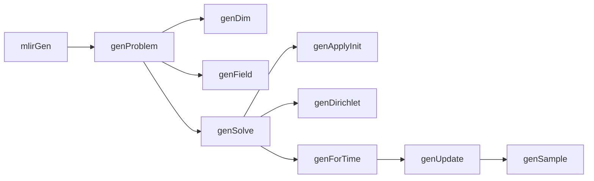
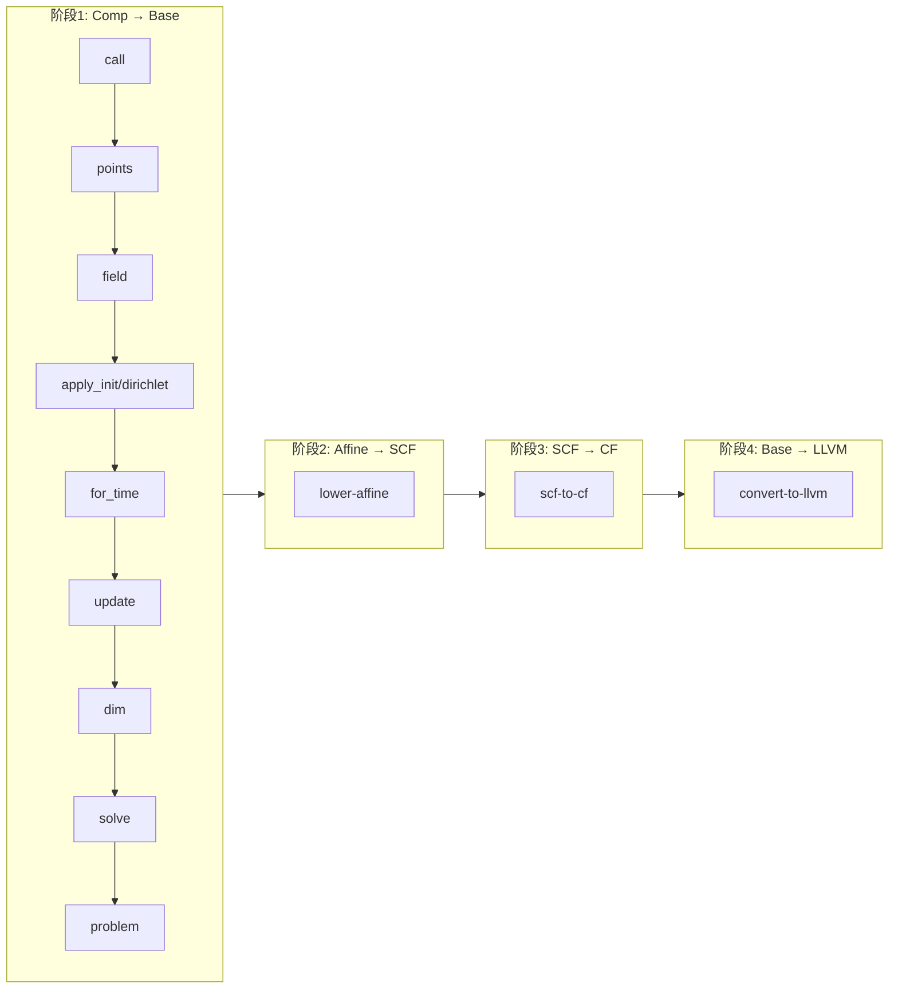

# comp语言编译器中端

## 1. 概述

中端负责将前端生成的 AST 转换为 MLIR IR，并通过多阶段降级最终生成 LLVM 方言。

## 2. 架构


## 3. IRGen (MLIRGen)

### 概述

MLIRGen 负责将 AST 和语义分析结果转换为 Comp 方言的 MLIR IR。

**输入**：`ParsedModule`（AST + `SemanticResult`）

**输出**：`ModuleOp`（Comp 方言的 MLIR 模块）

### 生成流程



### 设计决策

**方程分类**：根据 anchor（固定维度）区分方程类型
- 初始化方程：固定时间维 → `comp.apply_init`
- 边界方程：至少固定一个空间维 → `comp.dirichlet`
- 迭代方程：无固定维度 → `comp.update` 内的表达式

**Stencil 处理**：前端语义分析阶段收集所有 stencil 偏移信息，IRGen 根据偏移信息生成 `comp.sample` 操作。

**维度环境**：
- `dimIndexEnv`：维度 ID → 索引值（index 类型）
- `dimCoordEnv`：维度 ID → 坐标值（f64 类型）

## 4. Comp 方言

### 设计目标

Comp 方言是中端的最高级方言，用于承接前端的语义抽象，表达 PDE 数值求解问题。其设计遵循以下原则：

1. **问题级抽象**：直接映射 PDE 求解的核心概念（维度、场、边界条件）
2. **结构化表示**：使用 Region 封装计算逻辑，便于后续分析和优化
3. **渐进式降级**：支持分阶段降级到基础 MLIR 方言

### 类型

**FieldType** `!comp.field<T>`

场函数句柄，T 为元素类型（如 f64）。

### 属性

**AnchorAttr** `#comp.anchor<dim=@x, index=0>`

锚点：固定某维度的特定索引位置。

**RangeAttr** `#comp.range<dim=@x, lower=1, upper=-2>`

范围：遍历区间，支持负数表示 N-k（N 为该维点数）。

### 操作

#### YieldOp

**用处**：Region 终结符，产出计算结果。用于 `apply_init`、`dirichlet`、`update` 的 RHS region。

**Create**：
```cpp
comp::YieldOp::create(builder, loc, value);
```

**IR**：
```mlir
comp.yield %v : f64
```

---

#### ProblemOp

**用处**：顶层容器，封装整个 PDE 求解问题。所有 options 属性注入到此操作。

**Create**：
```cpp
comp::ProblemOp::create(builder, loc);
```

**IR**：
```mlir
comp.problem attributes {mode="time-pde", method="FDM"} {
  // dim, field, solve 等
}
```

---

#### DimOp

**用处**：维度声明，定义均匀网格的一个坐标轴。可标记为时间维。

**Create**：
```cpp
comp::DimOp::create(builder, loc, sym_name, lower, upper, points, timeVar);
```

**IR**：
```mlir
comp.dim @x domain<lower=0, upper=100, points=101>
comp.dim @t domain<lower=0, upper=10, points=11> timeVar
```

---

#### FieldOp

**用处**：场函数声明，表示待求解的未知函数。绑定空间维度和时间维度。

**Create**：
```cpp
comp::FieldOp::create(builder, loc, resultType, sym_name, spaceDims, timeDim);
```

**IR**：
```mlir
%u = comp.field @u(spaceDims=[@x], timeDim=@t) : !comp.field<f64>
```

---

#### PointsOp

**用处**：获取维度的网格点数。

**Create**：
```cpp
comp::PointsOp::create(builder, loc, resultType, dim);
```

**IR**：
```mlir
%N = comp.points @x : index
```

---

#### CoordOp

**用处**：根据索引计算均匀网格上的坐标值。计算公式：`coord = lower + (upper - lower) * (index / (points - 1))`

**Create**：
```cpp
comp::CoordOp::create(builder, loc, resultType, dim, iv);
```

**IR**：
```mlir
%x = comp.coord @x %ix : f64
```

---

#### SolveOp

**用处**：结构化求解入口，组织初始化、边界条件、时间步进三个阶段。

**Create**：
```cpp
comp::SolveOp::create(builder, loc, field);
```

**IR**：
```mlir
comp.solve %u {
  // init region
} boundary {
  // boundary region
} step {
  // step region
} : !comp.field<f64>
```

---

#### ApplyInitOp

**用处**：在场函数的特定时间层执行初始化。anchors 必须固定时间维。

**Create**：
```cpp
comp::ApplyInitOp::create(builder, loc, field, anchors);
```

**IR**：
```mlir
comp.apply_init %u anchors=[#comp.anchor<dim=@t, index=0>] {
^bb0(%ix: index):
  comp.yield %v : f64
} : !comp.field<f64>
```

---

#### DirichletOp

**用处**：声明 Dirichlet 边界条件。anchors 必须至少固定一个空间维。

**Create**：
```cpp
comp::DirichletOp::create(builder, loc, field, anchors);
```

**IR**：
```mlir
comp.dirichlet %u anchors=[#comp.anchor<dim=@x, index=0>] {
^bb0(%n: index):
  comp.yield %v : f64
} : !comp.field<f64>
```

---

#### ForTimeOp

**用处**：显式时间循环，迭代时间步。

**Create**：
```cpp
comp::ForTimeOp::create(builder, loc, lb, ub, step);
```

**IR**：
```mlir
comp.for_time 0 to %ub step 1 {
^bb0(%n: index):
  // 循环体
}
```

---

#### UpdateOp

**用处**：单时间步内的空间点更新。over 指定各空间维度的遍历范围。

**Create**：
```cpp
comp::UpdateOp::create(builder, loc, field, atTime, over);
```

**IR**：
```mlir
comp.update %u atTime=%n over=[#comp.range<dim=@x, lower=1, upper=-2>] {
^bb0(%ix: index):
  comp.yield %newVal : f64
} : !comp.field<f64>
```

---

#### SampleOp

**用处**：Stencil 读取操作，在场函数的指定坐标处采样（基坐标 + 常量偏移）。

**Create**：
```cpp
comp::SampleOp::create(builder, loc, resultType, field, indices, dims, shift);
```

**IR**：
```mlir
%v = comp.sample %u(%ix, %n) dims=[@x, @t] shift=[-1, 0] : (index, index) -> f64
```

---

#### CallOp

**用处**：记录标量函数调用，在后续降级阶段消除。

**Create**：
```cpp
comp::CallOp::create(builder, loc, resultType, callee, args);
```

**IR**：
```mlir
%v = comp.call @func(%a, %b) : (f64, f64) -> f64
```

---

## 5. 降级管线

### 四阶段流程



### 降级顺序说明

Comp 方言内部降级顺序的设计原则：

1. **依赖关系**：被依赖的操作先降级
2. **自底向上**：叶子操作先降级，容器操作最后降级

具体顺序：
- `call` → `points` → `field`：基础设施，被后续操作依赖
- `apply_init` / `dirichlet`：初始化和边界条件
- `for_time` → `update`：时间步进
- `dim`：维度信息在采样降级后不再需要
- `solve` → `problem`：容器最后降级

### 关键降级策略

**FieldOp → memref.alloc**

`!comp.field<f64>` 降级为 `memref<2 x N1 x N2 x ... x f64>`
- 第一维大小为 2，实现 ping-pong 时间缓冲
- 后续维度为各空间维度的网格点数

**CoordOp → arith 计算**

`comp.coord @x %ix` 降级为：`coord = lower + (upper - lower) * (index / (points - 1))`

**SampleOp → memref.load**

`comp.sample %u(%ix, %n) shift=[-1, 0]` 降级为：
```mlir
%shifted_ix = arith.addi %ix, %c-1 : index
%v = memref.load %field[%time, %shifted_ix] : memref<2 x 51 x f64>
```

---

## 6. 工具函数

### BuilderUtil.h

IR 构建辅助函数，提供常用的 builder 操作封装。

### LowerUtil.h

降级辅助函数：

- `stripCasts`：穿透 `UnrealizedConversionCastOp` 获取原始值
- `getDefiningFieldOp`：从场值获取底层 `memref.alloc` 操作
- `lookupDimOp`：通过符号引用查找 `comp.dim` 操作
- `lowerCoord`：坐标计算：`coord = lb + (ub-lb) * (index/(points-1))`
- `lowerSample`：Stencil 采样降级：memref 加载 + 偏移

---

## 7. 遇到的问题与解决方案

### 7.1 FieldOp 降级的类型桥接

**问题**：在降级管线中，`FieldOp` 的降级时机存在矛盾。其他操作（`ApplyInitOp`、`DirichletOp`、`UpdateOp`）在降级时需要向内存写入数据，因此 `FieldOp` 必须先降级为 `memref.alloc`，才能获得可写入的 buffer。然而其他操作的 SSA 操作数类型仍然是 `!comp.field<f64>`，若直接替换则类型不匹配导致引用失效。先降级则类型断链，后降级则无法写入内存。

**解决方案**：引入 `UnrankedMemRefType` 作为中间类型，配合 `UnrealizedConversionCastOp` 实现类型桥接。`TypeConverter` 将 `FieldType` 映射为无秩 memref，`applyPartialConversion` 自动插入 cast 操作桥接类型差异。后续降级 Pass 通过 `stripCasts` 穿透 cast 获取底层的 `memref.alloc`。

