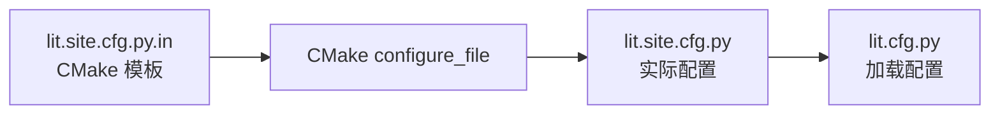
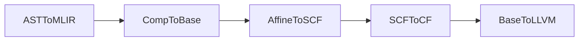
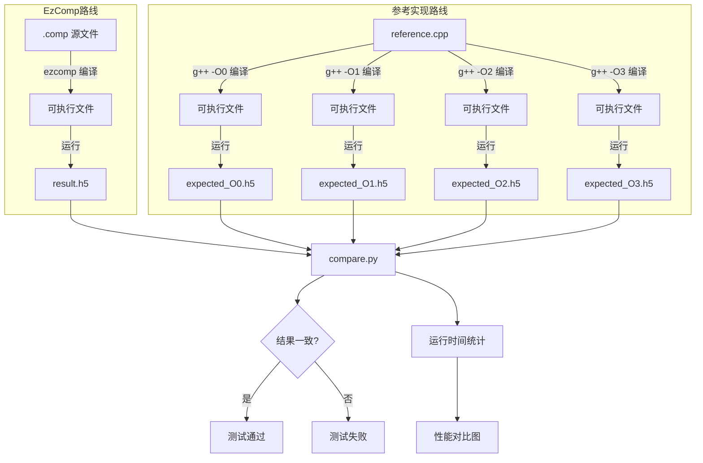

# 测试设计

## 1. 概述

测试用于验证编译器各阶段正确性，采用两种测试策略：

- **集成测试**：验证编译管线中每个降级阶段的输出正确性
- **比较测试**：端到端验证，比较实际输出与预期结果

测试框架使用 LLVM lit（集成测试）配合自定义 Python 脚本（比较测试）。

---

## 2. 集成测试

### 2.1 测试配置

测试采用 LLVM lit 框架，配置分为两层：

**lit.site.cfg.py.in**：CMake 模板文件，包含占位符（如 `@EZCOMP_EXECUTABLE@`），由 CMake 配置时替换为实际路径。

**lit.cfg.py**：运行时配置，定义替换变量（`%ezcomp`、`FileCheck`）供测试文件使用。

### 2.2 各阶段测试重点

**ASTToMLIR**：验证 Comp 方言操作正确生成
- ProblemOp、DimOp、FieldOp 等操作的存在与属性
- Region 结构正确性

**CompToBase**：验证降级后的基础方言结构
- memref 分配维度（ping-pong 缓冲）
- affine.for 循环嵌套结构
- memref.load/store 内存访问

**AffineToSCF / SCFToCF / BaseToLLVM**：验证后续降级正确性
- 控制流转换
- LLVM 方言生成

---

## 3. 比较测试

### 3.1 测试流程

参考实现使用不同优化等级编译，验证 EzComp 编译器生成的代码在各种优化级别下结果一致，同时统计并对比运行时间。

### 3.2 数值比较方法

使用相对误差和绝对误差判断数值是否匹配：
- 相对误差：`|actual - expected| / |expected|`
- 绝对误差：`|actual - expected|`

测试时通过 `rtol` 和 `atol` 参数设置允许的误差范围，两个误差只要有一个满足条件即认为匹配。

### 3.3 测试数据组织

每个测试目录包含：
- `.comp` 源文件
- `expected_result.h5` 预期输出（参考实现生成）
- 可选 `reference.cpp` 参考实现

---

## 4. 遇到的问题与解决方案

### 4.1 输出结果存在NaN的问题

**问题**：比较测试运行后，输出结果中 NaN 的个数与非边界点数相同。这说明边界点有正常数值，即 HDF5 的输入没有问题，问题出在计算环节。

**解决方案**：检查发现原始数据参数未通过数值稳定性验证，导致迭代计算发散。修改数据参数使其满足稳定性条件后，计算结果正常。

